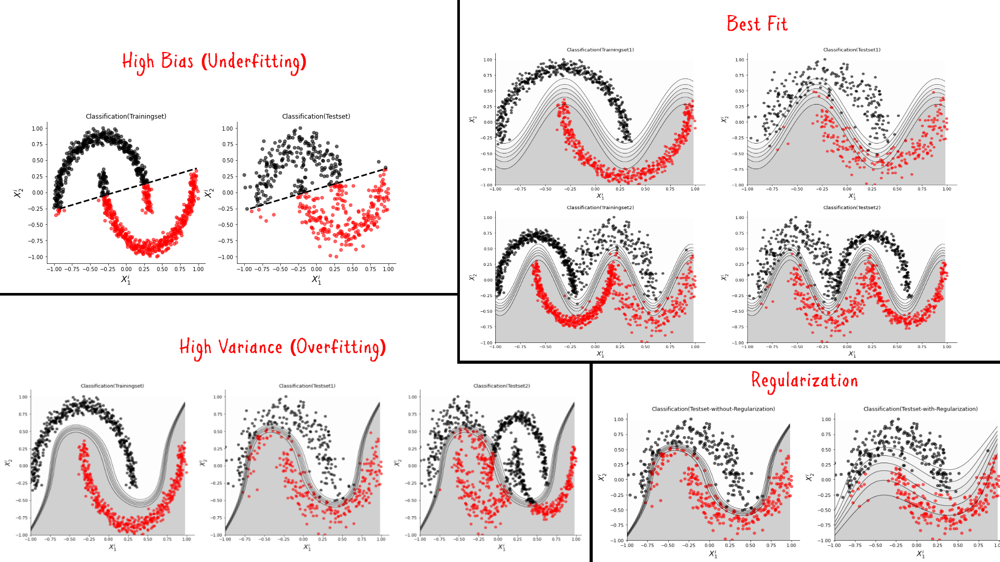

# ML Basics: Evaluation of Machine Learning Classifiers
## Bias-Variance Analysis, Performance Metrics, and Implementation of a Harmonic Classifier

## Requirements

* Python 3
* Numpy
* scikit-learn (needed only for sample data generation)

## Running The Notebook

* Open the Notebook in Google Colab or local jupyter server
* Install the requirements
* Restart the kernel if necessary 

## The tutorial 📃

The full tutorial is available on following links:

On Medium:

https://azad-wolf.medium.com/evaluation-of-machine-learning-classifiers-3912e7f5cf74

On Substack:

https://azadwolf.substack.com/p/evaluation-of-machine-learning-classifiers

